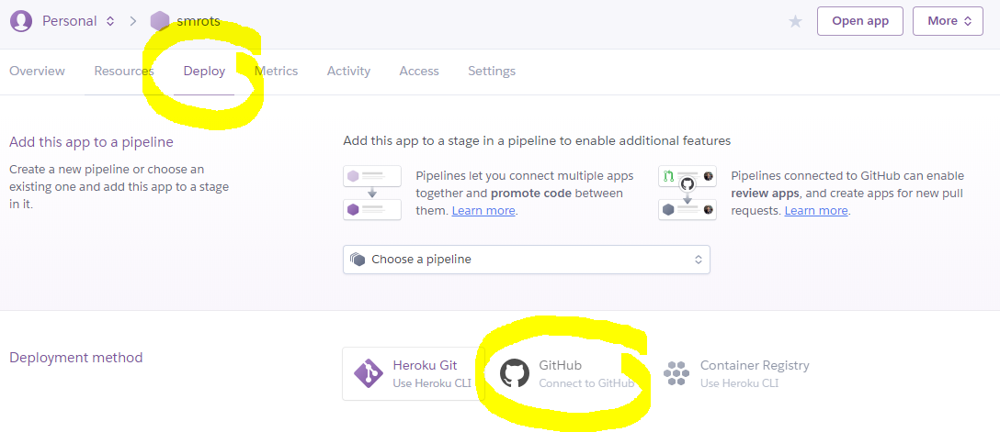
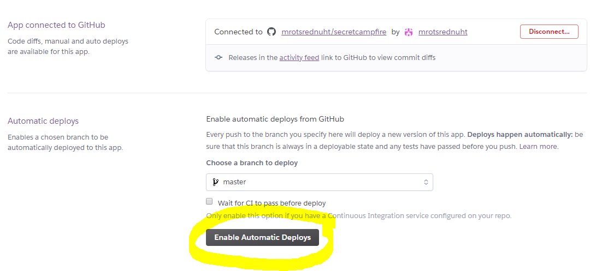
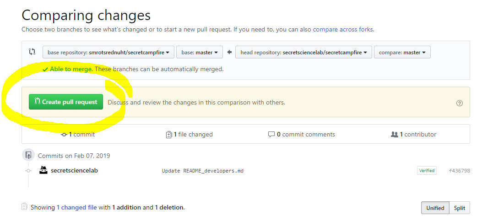
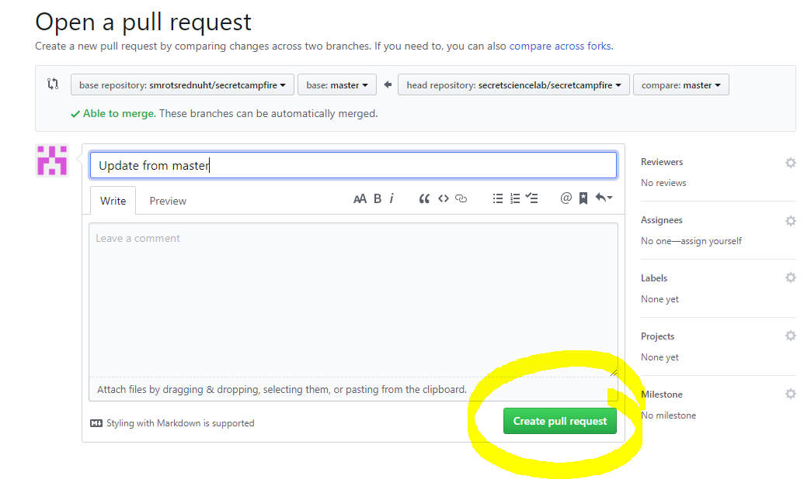
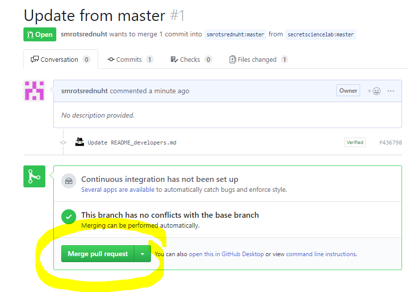

## Setup

1. Go to https://github.com/secretsciencelab/secretcampfire and click `Fork`. This pulls a snapshot of the master code into your personal GitHub account.

  

2. Go to https://dashboard.heroku.com and select your blog/app. Click on the `Deploy` tab and under `Deployment method` click ` GitHub`.

  

3. Find the `Connect to GitHub` section. Search for the `secretcampfire` repository in your GitHub account. (This was created in Step 1. above). Click `Connect`.

  

4. Find the `Automatic deploys` section. Click `Enable Automatic Deploys`. Now whenever your personal `secretcampfire` repository is updated, the new code will automatically get installed on your blog.

  

## Syncing your blog to the latest code

1. Login to https://github.com and go to your snapshot/fork of `secretcampfire`. The URL should look like `https://github.com/<yourname>/secretcampfire`.
  

2. In your browser's address bar, add `/compare/master...secretsciencelab:master` to the end of the URL. The URL should now look like `https://github.com/<yourname>/secretcampfire/compare/master...secretsciencelab:master`.

3. Verify the changes you are about to sync from the master repository. Click `Create pull request`.

  

4. Enter some notes for your own reference if you like. Or just enter `Sync`. Click `Create pull request`

  

5. Scroll down and wait for the green button to pop up. Click `Merge pull request`. Click `Confirm merge`.

  

6. That's it! Because you set up your site to *automatically deploy* from this respository earlier, it will do just that. Now sit back and relax. In a few minutes, your blog will be upgraded to the latest code from the master repository. Enjoy!
